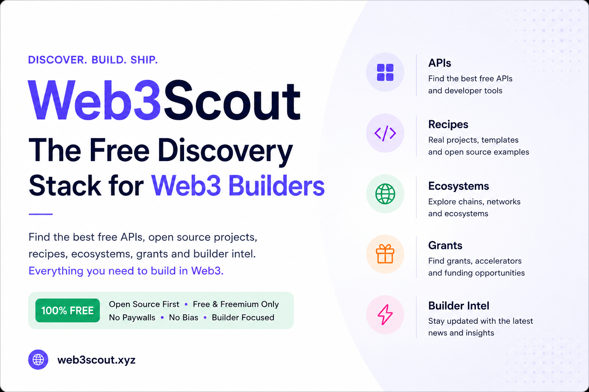

# Web3Scout



**Everything you need to build in Web3, free and open.** APIs, developer tools, recipes, startup ideas, grants, ecosystems, and builder intel in one curated directory.

[Web3Scout](https://github.com/shahtab123/Web3Stack) is a no-login discovery site for builders who want to ship without hunting across dozens of bookmark folders. Each listing is hand-curated: we favor **free tiers**, **open source**, and **self-serve** tools, and we leave out paid-only products and sponsored placements.

### What you can explore

| Section | What you get |
|--------|----------------|
| **APIs & tools** | Wallets, RPC, oracles, trading, identity, data, with filters by category and ecosystem |
| **Recipes** | GitHub starters and reference apps to clone and adapt |
| **Ideas** | Product and startup concepts wired to real APIs and ecosystems |
| **Grants** | Programs, hackathons, and funding with deadlines and links |
| **Ecosystems** | Portal pages for Base, Ethereum, Solana, and more |
| **Builder Intel** | Curated posts from X, Reddit, Farcaster, and blogs: APIs, launches, grants |
| **Crypto stocks** | Public companies with crypto exposure and market snapshots |
| **Search** | One search across every directory |

The site runs entirely in the open: browse, filter, and search with **no accounts**. Optional Neon + Drizzle powers editable catalog data when you self-host; without a database, static seed data still works for local dev and demos.

---

## Stack

- **Next.js 16** (App Router)
- **React 19** + **TypeScript**
- **Tailwind CSS 4** + **shadcn/ui**
- **Neon PostgreSQL** + **Drizzle ORM**

## Design

- Black and white theme only
- Max content width 1280px
- Sticky navbar, consistent page headers
- Cards, filters, and search
- No authentication, no user accounts

## Production: Cloudflare + Vercel (Optional)

For **free DNS**, **CDN/proxy**, **SSL**, caching, and DDoS protection in front of Vercel:

1. Add your domain in **Vercel** (project → Domains).
2. Add the same domain in **Cloudflare** (free plan) and point registrar nameservers to Cloudflare.
3. Set DNS records to Vercel with **Proxied** (orange cloud) enabled.
4. Cloudflare SSL: **Full (strict)** + **Always Use HTTPS**.

Full step-by-step: [docs/cloudflare-setup.md](docs/cloudflare-setup.md)

## Getting started

```bash
cp .env.example .env.local
npm install
npm run dev
```

The app runs with static seed data when `DATABASE_URL` is not set.

### Connect Neon

1. Create a project at [neon.tech](https://neon.tech)
2. Copy your connection string to `.env.local`
3. Push schema and seed:

```bash
npm run db:push
npm run db:seed
```

## Scripts

| Command | Description |
|---------|-------------|
| `npm run dev` | Start development server |
| `npm run build` | Production build |
| `npm run db:push` | Push schema to Neon |
| `npm run db:seed` | Seed directory data |
| `npm run db:studio` | Open Drizzle Studio |

## Pages

- `/` - Discover homepage with search, featured APIs, recipes, ecosystems, grants, and intel
- `/apis` - API & developer tools directory
- `/recipes` - Build recipes and starter projects
- `/ideas` - Startup and product ideas for builders
- `/ecosystems` - Blockchain ecosystem portals
- `/grants` - Grants, hackathons, and funding programs
- `/builder-intel` - Curated builder intel from across the web
- `/crypto-stocks` - Public companies with crypto exposure
- `/search` - Global search across directories
- `/about` - Project info and setup
- `/submit` - Submit a resource
